# SISOP-5-2026-IT-108
# Praktikum Sistem Operasi Modul 5 – Soal 1
# Farewell Party OS

<div align="center">

### Nama : Nadia Iqlima
### NRP : 5027251108

</div>

---

# Daftar Isi

- [Deskripsi Praktikum](#deskripsi-praktikum)
- [Persiapan Environment](#persiapan-environment)
- [Instalasi Dependency](#instalasi-dependency)
- [Build Linux Kernel](#build-linux-kernel)
- [Single User Filesystem](#single-user-filesystem)
- [Multi User Filesystem](#multi-user-filesystem)
- [Menjalankan Sistem Menggunakan QEMU](#menjalankan-sistem-menggunakan-qemu)
- [Membuat ISO Bootable](#membuat-iso-bootable)
- [Backup Otomatis](#backup-otomatis)
- [Konfigurasi Internet](#konfigurasi-internet)
- [Package Manager Party](#package-manager-party)
- [Implementasi FUSE](#implementasi-fuse)
- [Rangkuman Command](#rangkuman-command)
- [Kesimpulan](#kesimpulan)

---

# Deskripsi Praktikum

Pada praktikum ini dilakukan pembangunan sistem operasi Linux minimal menggunakan Linux Kernel yang dikompilasi sendiri serta BusyBox sebagai userspace. Sistem operasi yang dibangun harus mampu berjalan pada dua mode yaitu Single User dan Multi User. Selain itu sistem juga harus dapat dijalankan menggunakan QEMU, dibuat menjadi ISO bootable menggunakan GRUB, mendukung fitur backup, memiliki koneksi internet, menyediakan package manager sederhana, dan mengimplementasikan filesystem menggunakan FUSE.

Praktikum ini bertujuan untuk memberikan pemahaman mengenai proses boot Linux mulai dari level kernel hingga userspace, serta memahami bagaimana sebuah sistem operasi dapat dibangun dari komponen-komponen dasar yang tersedia pada ekosistem Linux.

---

# Persiapan Environment

Langkah pertama adalah menyiapkan struktur direktori yang akan digunakan selama praktikum.

```bash
mkdir -p soal_1/osboot

cd soal_1

touch .config
touch backup.sh
touch iso.sh
touch kernel.sh
touch multi.sh
touch qemu.sh
touch single.sh
```

Struktur tersebut digunakan untuk memisahkan file hasil build dengan script yang digunakan selama pengerjaan.

## Hasil


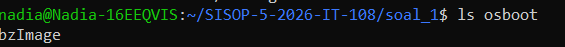


---

# Instalasi Dependency

Sebelum melakukan build kernel Linux, diperlukan beberapa tools pendukung.

## Pengecekan Tools

```bash
gcc --version
make --version
wget --version
qemu-system-x86_64 --version
```

Karena QEMU belum tersedia, dilakukan instalasi terlebih dahulu.

```bash
sudo apt update
sudo apt install qemu-system-x86
```

Selanjutnya dilakukan instalasi dependency lain yang diperlukan.

```bash
sudo apt install build-essential \
wget \
cpio \
gzip \
bison \
flex \
libssl-dev \
libelf-dev \
bc \
grub-pc-bin \
xorriso
```

## Hasil


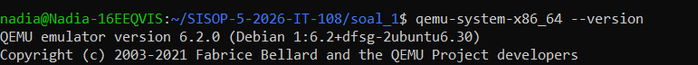

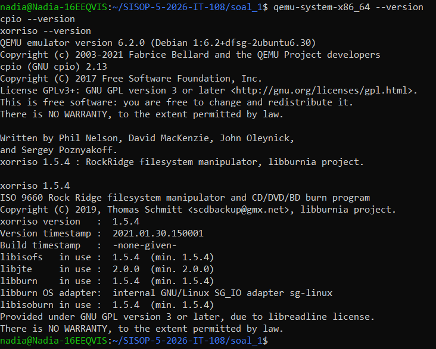


## Analisis

| Dependency | Fungsi |
|------------|---------|
| gcc | Compiler bahasa C |
| make | Build automation |
| wget | Mengunduh source code |
| cpio | Membuat initramfs |
| gzip | Kompresi filesystem |
| grub-pc-bin | Bootloader GRUB |
| xorriso | Membuat file ISO |
| bc | Operasi matematika saat build kernel |
| flex | Lexical analyzer |
| bison | Parser generator |

Seluruh dependency berhasil dipasang sehingga sistem siap digunakan untuk melakukan kompilasi kernel Linux.

---

# Build Linux Kernel

Tahapan berikutnya adalah mengunduh source code Linux Kernel versi 6.1.1 dan melakukan kompilasi hingga menghasilkan file kernel yang dapat digunakan saat booting.

## Source Code kernel.sh

```bash
#!/bin/bash
set -e

VER=6.1.1

mkdir -p build osboot
cd build

if [ ! -f linux-$VER.tar.xz ]; then
 wget https://cdn.kernel.org/pub/linux/kernel/v6.x/linux-$VER.tar.xz
fi

if [ ! -d linux-$VER ]; then
 tar xf linux-$VER.tar.xz
fi

cd linux-$VER

if [ ! -f .config ]; then
 make defconfig
fi

make -j$(nproc)

cp arch/x86/boot/bzImage ../../osboot/

echo "Kernel selesai -> osboot/bzImage"
```

## Menjalankan Script

```bash
chmod +x kernel.sh
./kernel.sh
```

## Hasil


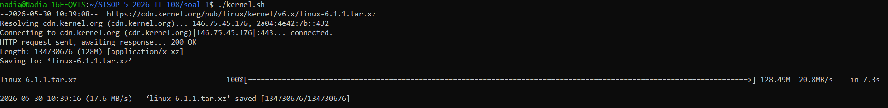

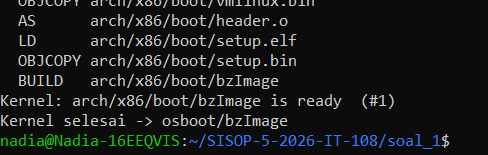


## Analisis

Script di atas bertugas mengunduh source code kernel Linux, mengekstraknya, membuat konfigurasi default, kemudian melakukan kompilasi menggunakan seluruh core CPU yang tersedia. Hasil kompilasi berupa file `bzImage` disimpan pada direktori `osboot` dan akan digunakan sebagai kernel utama saat sistem dijalankan menggunakan QEMU maupun saat dibangun menjadi ISO bootable.

---

# Single User Filesystem

Filesystem single-user dibuat menggunakan BusyBox sebagai userspace minimal.

## Source Code single.sh

```bash
#!/bin/bash
set -e

mkdir -p build
cd build

BUSYBOX=1.36.1

if [ ! -f busybox-$BUSYBOX.tar.bz2 ]; then
 wget https://busybox.net/downloads/busybox-$BUSYBOX.tar.bz2
fi

if [ ! -d busybox-$BUSYBOX ]; then
 tar xf busybox-$BUSYBOX.tar.bz2
fi

cd busybox-$BUSYBOX

if [ ! -f .config ]; then
 make defconfig
 sed -i 's/# CONFIG_STATIC is not set/CONFIG_STATIC=y/' .config
fi

make -j$(nproc)
make install

cd ../..

rm -rf rootfs-single
mkdir -p rootfs-single

cp -a build/busybox-$BUSYBOX/_install/* rootfs-single/

mkdir -p rootfs-single/{dev,proc,sys,etc,tmp,root}

cat > rootfs-single/init << 'EOF'
#!/bin/sh

mount -t proc proc /proc
mount -t sysfs sysfs /sys
mount -t devtmpfs devtmpfs /dev

echo "Farewell Party"
echo "Welcome, root"

exec /bin/sh
EOF

chmod +x rootfs-single/init

cd rootfs-single
find . | cpio -H newc -ov | gzip > ../osboot/single.gz
cd ..

echo "Single filesystem selesai -> osboot/single.gz"
```

## Menjalankan

```bash
chmod +x single.sh
./single.sh
```

## Hasil


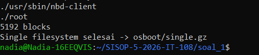

## Analisis

Filesystem single-user dibuat menggunakan BusyBox yang telah dikompilasi secara statis sehingga tidak bergantung pada library eksternal. Pada saat booting, script `init` akan melakukan mounting terhadap proc, sysfs, dan devtmpfs sebelum menampilkan shell root.

---

# Multi User Filesystem

Mode multi-user dibangun dengan menambahkan beberapa user ke dalam filesystem.

## User yang Dibuat

| Username | Home Directory |
|-----------|---------------|
| root | /root |
| henn | /home/henn |
| hann | /home/hann |
| viii | /home/viii |
| kids | /home/kids |

## Hasil


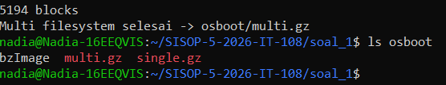


## Analisis

Filesystem multi-user memperluas single-user filesystem dengan menambahkan file:

```text
/etc/passwd
/etc/group
/etc/shadow
```

serta direktori home untuk masing-masing user.

---

# Menjalankan Sistem Menggunakan QEMU

QEMU digunakan sebagai emulator untuk menguji sistem operasi tanpa perlu melakukan reboot pada perangkat utama.

## Source Code qemu.sh

```bash
#!/bin/bash

case "$1" in

 --single)
 qemu-system-x86_64 \
 -kernel osboot/bzImage \
 -initrd osboot/single.gz \
 -append "console=ttyS0" \
 -nographic
 ;;

 --multi)
 qemu-system-x86_64 \
 -kernel osboot/bzImage \
 -initrd osboot/multi.gz \
 -append "console=ttyS0" \
 -nographic
 ;;

 --all)
 qemu-system-x86_64 \
 -cdrom osboot/farewell.iso \
 -boot d \
 -nographic
 ;;

 *)
 echo "./qemu.sh --single"
 echo "./qemu.sh --multi"
 echo "./qemu.sh --all"
 ;;
esac
```

## Pengujian

```bash
./qemu.sh --multi
```

## Hasil

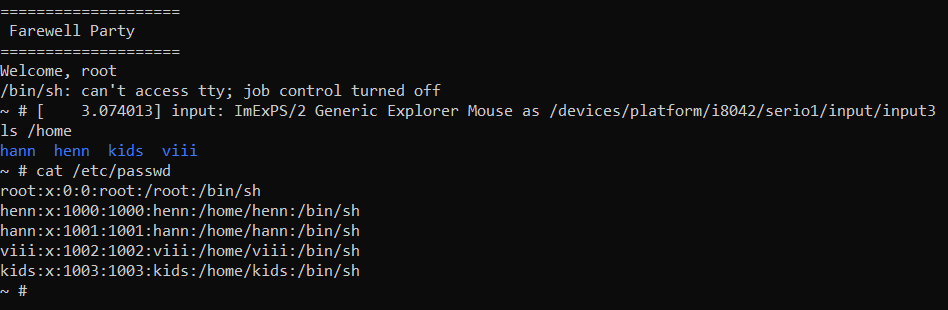

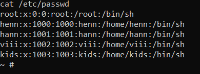


---

# Membuat ISO Bootable

ISO dibuat menggunakan GRUB sebagai bootloader.

## Source Code iso.sh

```bash
#!/bin/bash
set -e

rm -rf iso
mkdir -p iso/boot/grub

cp osboot/bzImage iso/boot/
cp osboot/single.gz iso/boot/
cp osboot/multi.gz iso/boot/

cat > iso/boot/grub/grub.cfg << EOF
set timeout=5
set default=0

menuentry "Single User" {
 linux /boot/bzImage console=ttyS0
 initrd /boot/single.gz
}

menuentry "Multi User" {
 linux /boot/bzImage console=ttyS0
 initrd /boot/multi.gz
}
EOF

grub-mkrescue -o osboot/farewell.iso iso

echo "ISO selesai -> osboot/farewell.iso"
```

## Hasil


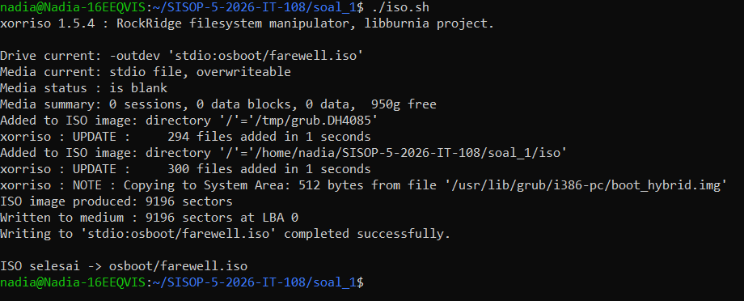


---

# Backup Otomatis

## Source Code backup.sh

```bash
#!/bin/bash

set -e

TS=$(date +%d%m%Y-%H%M%S)

zip -r \
 osboot/farewell_backup_$TS.zip \
 osboot/bzImage \
 osboot/single.gz \
 osboot/multi.gz \
 osboot/farewell.iso

echo "Backup selesai"
```

## Analisis

Backup dilakukan menggunakan timestamp agar setiap file backup memiliki nama unik dan tidak saling menimpa.

---

# Konfigurasi Internet

Agar guest OS dapat terhubung ke internet, dilakukan konfigurasi jaringan secara manual.

```bash
ifconfig eth0 up
udhcpc -i eth0
ifconfig eth0 10.0.2.15 netmask 255.255.255.0 up
route add default gw 10.0.2.2
echo "nameserver 8.8.8.8" > /etc/resolv.conf
```

## Pengujian

```bash
ping -c 3 8.8.8.8

wget example.com
```

## Hasil


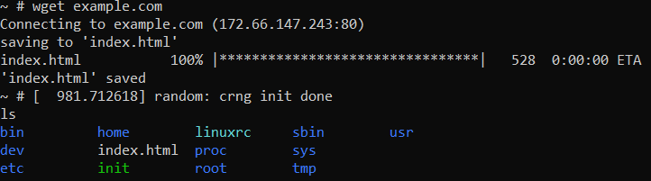


---

# Package Manager Party

Package manager sederhana dibuat dengan nama `party`.

## Source Code

```bash
#!/bin/sh

CMD="$1"
PKG="$2"

if [ "$CMD" = "install" ]; then
 echo "Installing $PKG..."
 wget "$PKG"
else
 echo "Usage: party install <url>"
fi
```

## Pengujian

```bash
party
```

Output:

```text
Usage: party install <url>
```

## Hasil


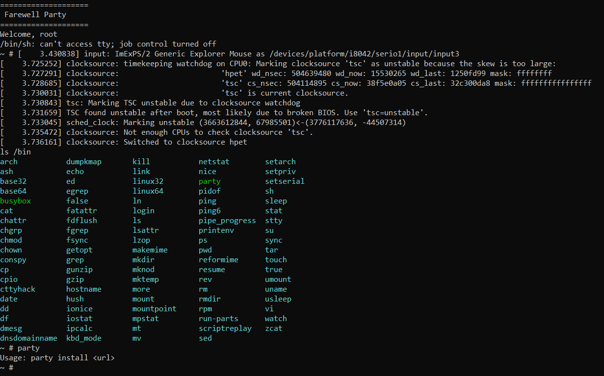


---

# Implementasi FUSE

FUSE digunakan untuk membuat filesystem virtual di userspace tanpa perlu membuat kernel module.

Filesystem yang dibuat hanya memiliki satu file virtual:

```text
/hello
```

Ketika file tersebut dibaca, sistem akan menampilkan pesan:

```text
Halo dari FUSE!
```

## Callback yang Digunakan

| Callback | Fungsi |
|-----------|---------|
| getattr | Metadata file |
| readdir | Menampilkan isi direktori |
| open | Membuka file |
| read | Membaca isi file |

## Hasil


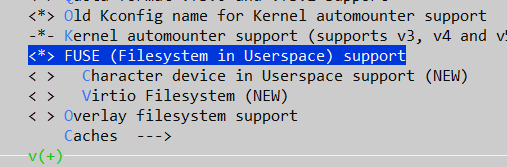

## Analisis

Implementasi FUSE menunjukkan bahwa filesystem tidak harus disimpan secara fisik pada media penyimpanan. Isi file dapat dihasilkan secara dinamis melalui program userspace yang menangani callback tertentu.

---

# Rangkuman Command

| Command | Fungsi |
|----------|----------|
| wget | Download file |
| tar | Extract archive |
| make | Build program |
| cpio | Membuat initramfs |
| gzip | Kompres filesystem |
| qemu-system-x86_64 | Menjalankan VM |
| grub-mkrescue | Membuat ISO |
| zip | Backup file |
| ping | Uji koneksi |
| wget example.com | Uji akses internet |
| fuse_main | Menjalankan filesystem FUSE |

---

# Kesimpulan

Pada praktikum ini berhasil dibangun sebuah sistem operasi Linux minimal mulai dari proses kompilasi kernel Linux, pembuatan filesystem single-user dan multi-user menggunakan BusyBox, pembuatan image ISO bootable menggunakan GRUB, virtualisasi menggunakan QEMU, konfigurasi jaringan internet, implementasi package manager sederhana, hingga pembuatan filesystem virtual menggunakan FUSE.

Melalui praktikum ini diperoleh pemahaman yang lebih mendalam mengenai proses boot Linux, struktur filesystem, virtualisasi, manajemen user, serta interaksi antara kernel dan userspace dalam pengembangan sistem operasi modern.